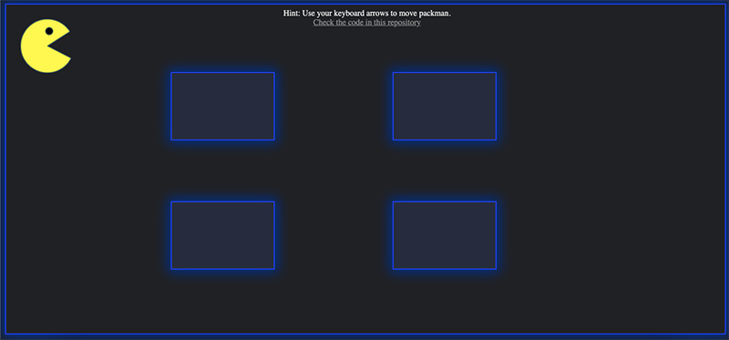

### MIT Lab - Week 4

# Title

Pac-Man MIT Lab

# Description

This project is supposed to be challenging and useful for people learning javascript, created as part of one of our assignments during the Full Stack Development career in 2021.

The page let's you move the iconic "Pac-Man" character on the screen and contains collision detection. If you try to move the character off the screen or over one of the inner borders, the character will stop moving on that direction.

It was build using plain javascript, and only used jQuery for animating the movement to make it a little smoother.

Live Preview: https://renzodupont.github.io/mit-career-2021/week-04/index.html

# How to run

The project doesn't need anything specific to work. Just open the index.html in your browser.

# Future improvements

<ul>
  <li>Add ghosts and the ability to eat them by the Pac-Man</li>
  <li>Add a more complex stage and smaller character</li>
</ul>

# Contact info

📫 https://www.linkedin.com/in/renzo-dupont-b9797941/ | https://twitter.com/renzodupont | https://instagram.com/renzodupont

# License information

MIT Licensed
